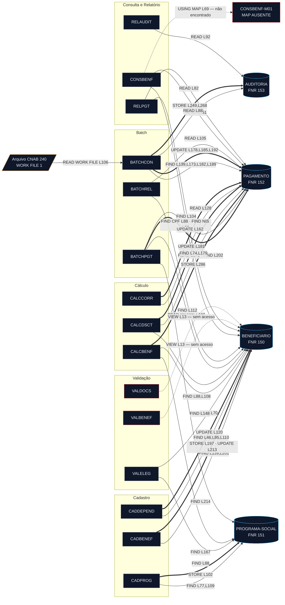
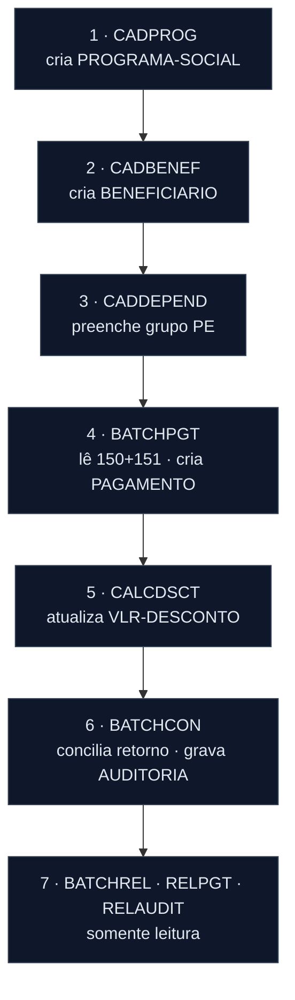

<!-- markdownlint-disable MD012 MD013 MD022 MD025 MD026 MD028 MD029 MD031 MD033 MD034 MD038 MD040 MD051 MD060 -->

# Mapa de Dependências — SIFAP Legado

  

> 🗺 **Você está aqui:** [Kit PT-BR](../README.md) → [Estágio 1](README.md) → **dependency-map**

> **Estágio 1 · Passo 3 (`/map-dependencies`)**
>
> Mapeie somente as dependências que explicam o recorte escolhido: programas `.NSN` → programas
> (`CALLNAT`, `FETCH`) e programas → DDMs (`READ`, `FIND`, `STORE`, `UPDATE`, `DELETE`).
> **Cada aresta deve ser apoiada por um `arquivo:linha` real — nada de chute.**
> Este mapa alimenta as hipóteses de carving do [`discovery-report.md`](discovery-report.md).
>
> 📘 **Guia passo a passo:** [`GUIDE.md`](GUIDE.md).

**Time**: `<preencher>`
**Escopo**: `01-arqueologia/legado-sifap/natural-programs/` (15 programas) × `adabas-ddms/` (4 DDMs) — **codebase completa**
**Rastreamento**: recursivo não aplicável — ver achado abaixo
**Data**: 2026-08-12
**Diagrama**: [`dependency-map.mmd`](dependency-map.mmd)

---

## 🚨 Achado principal — o grafo programa→programa é vazio

Busca por `CALLNAT`, `INCLUDE`, `FETCH`, `STACK` e `CALL` nos 15 arquivos `.NSN`:

```
0 ocorrências
```

**Nenhum programa chama outro programa.** As 23 ocorrências de `PERFORM` encontradas são todas
sub-rotinas **internas** ao próprio arquivo. Não existe copycode, não existe subprograma compartilhado.

Consequência para a modernização: **todo o acoplamento do SIFAP é indireto, via arquivos Adabas
compartilhados.** A fronteira de módulo não pode ser derivada de chamadas — ela precisa ser derivada
de quem escreve em qual arquivo.

---

## Diagrama Mermaid



> Legenda: seta cheia fina = leitura · seta grossa `==>` = **escrita** · seta tracejada = referência declarada mas não executada.

## Arestas Programa → Programa

| # | De | Para | Tipo (`CALLNAT`/`FETCH`) | Evidência (`arquivo:linha`) |
| - | -- | ---- | ------------------------ | --------------------------- |
| — | — | — | — | **Nenhuma. Zero ocorrências de `CALLNAT`, `INCLUDE`, `FETCH`, `STACK` e `CALL` nos 15 arquivos.** |

## Arestas Programa → DDM

47 acessos a dados, todos com evidência. Ordenados por programa.

| # | Programa | DDM | Operação | Descritor / chave | Evidência |
| -: | --- | --- | --- | --- | --- |
| 1 | `BATCHCON` | AUDITORIA | READ | `SEQ-AUDIT` (DESCENDING) | `BATCHCON.NSN:L88` |
| 2 | `BATCHCON` | *(externo)* CNAB 240 | READ WORK FILE | — | `BATCHCON.NSN:L105-106` |
| 3 | `BATCHCON` | PAGAMENTO | FIND | `NUM-PAGTO` | `BATCHCON.NSN:L139` |
| 4 | `BATCHCON` | PAGAMENTO | FIND | `NUM-PAGTO` | `BATCHCON.NSN:L173` |
| 5 | `BATCHCON` | PAGAMENTO | **UPDATE** | — | `BATCHCON.NSN:L178` |
| 6 | `BATCHCON` | PAGAMENTO | FIND | `NUM-PAGTO` | `BATCHCON.NSN:L182` |
| 7 | `BATCHCON` | PAGAMENTO | **UPDATE** | — | `BATCHCON.NSN:L185` |
| 8 | `BATCHCON` | PAGAMENTO | FIND | `NUM-PAGTO` | `BATCHCON.NSN:L189` |
| 9 | `BATCHCON` | PAGAMENTO | **UPDATE** | — | `BATCHCON.NSN:L192` |
| 10 | `BATCHCON` | AUDITORIA | **STORE** | — | `BATCHCON.NSN:L249` |
| 11 | `BATCHCON` | AUDITORIA | **STORE** | — | `BATCHCON.NSN:L268` |
| 12 | `BATCHPGT` | PAGAMENTO | READ | `NUM-PAGTO` (DESCENDING) | `BATCHPGT.NSN:L171` |
| 13 | `BATCHPGT` | BENEFICIARIO | READ | `CPF` | `BATCHPGT.NSN:L182` |
| 14 | `BATCHPGT` | PAGAMENTO | FIND | `CPF-BENEF` | `BATCHPGT.NSN:L202` |
| 15 | `BATCHPGT` | PROGRAMA-SOCIAL | FIND | `COD-PROGRAMA` | `BATCHPGT.NSN:L214` |
| 16 | `BATCHPGT` | PAGAMENTO | **STORE** | — | `BATCHPGT.NSN:L335` |
| 17 | `BATCHREL` | PAGAMENTO | READ | `COMPETENCIA` | `BATCHREL.NSN:L105` |
| 18 | `BATCHREL` | BENEFICIARIO | FIND | `CPF` | `BATCHREL.NSN:L112` |
| 19 | `CADBENEF` | BENEFICIARIO | FIND | `CPF` | `CADBENEF.NSN:L139` |
| 20 | `CADBENEF` | BENEFICIARIO | **STORE** | — | `CADBENEF.NSN:L197` |
| 21 | `CADBENEF` | BENEFICIARIO | FIND | `CPF` | `CADBENEF.NSN:L201` |
| 22 | `CADBENEF` | BENEFICIARIO | **UPDATE** | — | `CADBENEF.NSN:L213` |
| 23 | `CADDEPEND` | BENEFICIARIO | FIND | `CPF` | `CADDEPEND.NSN:L46` |
| 24 | `CADDEPEND` | BENEFICIARIO | FIND | `CPF` | `CADDEPEND.NSN:L95` |
| 25 | `CADDEPEND` | BENEFICIARIO | FIND | `CPF` | `CADDEPEND.NSN:L110` |
| 26 | `CADDEPEND` | BENEFICIARIO | **UPDATE** | grupo `PE` de dependentes | `CADDEPEND.NSN:L120` |
| 27 | `CADPROG` | PROGRAMA-SOCIAL | FIND | `COD-PROGRAMA` | `CADPROG.NSN:L77` |
| 28 | `CADPROG` | PROGRAMA-SOCIAL | **STORE** | — | `CADPROG.NSN:L102` |
| 29 | `CADPROG` | PROGRAMA-SOCIAL | FIND | `COD-PROGRAMA` | `CADPROG.NSN:L109` |
| 30 | `CALCBENF` | BENEFICIARIO | FIND | `CPF` | `CALCBENF.NSN:L148` |
| 31 | `CALCBENF` | PROGRAMA-SOCIAL | FIND | `COD-PROGRAMA` | `CALCBENF.NSN:L167` |
| 32 | `CALCBENF` | PAGAMENTO | **STORE** | ⚠️ sem `NUM-PAGTO` atribuído | `CALCBENF.NSN:L286` |
| 33 | `CALCCORR` | PAGAMENTO | READ | `CPF-BENEF` | `CALCCORR.NSN:L128` |
| 34 | `CALCCORR` | PAGAMENTO | **UPDATE** | — | `CALCCORR.NSN:L162` |
| 35 | `CALCDSCT` | PAGAMENTO | FIND | `NUM-PAGTO` | `CALCDSCT.NSN:L74` |
| 36 | `CALCDSCT` | BENEFICIARIO | FIND | `CPF` | `CALCDSCT.NSN:L88` |
| 37 | `CALCDSCT` | BENEFICIARIO | FIND | `CPF` | `CALCDSCT.NSN:L108` |
| 38 | `CALCDSCT` | PAGAMENTO | FIND | `NUM-PAGTO` | `CALCDSCT.NSN:L179` |
| 39 | `CALCDSCT` | PAGAMENTO | **UPDATE** | — | `CALCDSCT.NSN:L181` |
| 40 | `CONSBENF` | BENEFICIARIO | FIND | `CPF` | `CONSBENF.NSN:L88` |
| 41 | `CONSBENF` | BENEFICIARIO | FIND | ⚠️ `NIS` — descritor inexistente no DDM | `CONSBENF.NSN:L92` |
| 42 | `CONSBENF` | PAGAMENTO | READ | `CPF-BENEF` | `CONSBENF.NSN:L151` |
| 43 | `RELAUDIT` | AUDITORIA | READ | `DT-EVENTO` | `RELAUDIT.NSN:L92` |
| 44 | `RELPGT` | PAGAMENTO | READ | `COMPETENCIA` | `RELPGT.NSN:L82` |
| 45 | `RELPGT` | BENEFICIARIO | FIND | `CPF` | `RELPGT.NSN:L104` |
| 46 | `VALELEG` | BENEFICIARIO | FIND | `CPF` | `VALELEG.NSN:L70` |
| 47 | `VALELEG` | PROGRAMA-SOCIAL | FIND | `COD-PROGRAMA` | `VALELEG.NSN:L88` |

### VIEWs declaradas sem nenhum acesso

| Programa | VIEW | Evidência | Observação |
| --- | --- | --- | --- |
| `VALBENEF` | `BENEFICIARIO` | `VALBENEF.NSN:L13` | Nenhum `FIND`/`READ`/`STORE`/`UPDATE` no arquivo inteiro. |
| `VALDOCS` | `BENEFICIARIO` | `VALDOCS.NSN:L13` | Idem. Declara `DOCUMENTOS-OK` e nunca o grava. |

## Dependências intra-programa (`PERFORM`)

23 chamadas, todas para sub-rotinas do próprio arquivo. **Não geram arestas no grafo.**

| Programa | Sub-rotina | Linha |
| --- | --- | --- |
| `BATCHCON` | `GRAVA-AUDITORIA-DIVERG` | L167 |
| `BATCHCON` | `GRAVA-AUDITORIA-CONC` | L201 |
| `BATCHCON` | `CONCILIA-REAL` *(comentado)* | L222 |
| `BATCHPGT` | `DET-FAIXA-RENDA-BATCH` | L262 |
| `BATCHREL` | `IMPRIME-CABECALHO` | L172 |
| `CADBENEF` | `VALIDA-CPF` | L112 |
| `CADPROG` | `CONSULTA-PROG` | L57 |
| `CALCBENF` | `DET-FAIXA-RENDA` | L202 |
| `CALCBENF` | `CALC-DESCONTOS` | L263 |
| `CALCCORR` | `CALC-INDICE-ACUM` | L149 |
| `CALCDSCT` | `CALC-CONTRIB-SOCIAL` | L99 |
| `CONSBENF` | `MASCARA-CPF` | L107 |
| `RELAUDIT` | `IMPRIME-CAB-AUDIT` | L165 |
| `RELPGT` | `IMPRIME-SUBTOTAL` | L94, L174 |
| `RELPGT` | `IMPRIME-CABECALHO` | L145 |
| `VALBENEF` | `VALIDA-CPF-COMPLETO` | L115 |
| `VALBENEF` | `VALIDA-DATA` | L125 |
| `VALBENEF` | `VALIDA-NOME` | L135 |
| `VALDOCS` | `VALIDA-CPF-DOC` | L68 |
| `VALDOCS` | `VALIDA-RG` | L78 |
| `VALDOCS` | `CHECK-DOC-ESPECIAL` | L88 |
| `VALELEG` | `VERIF-ELEG-ESPECIFICA` | L207 |

## Referências Quebradas

### No código

| # | Referência | Tipo | Evidência | Situação |
| -: | --- | --- | --- | --- |
| 1 | `CONSBENF-M01` | `INPUT USING MAP` | `CONSBENF.NSN:L69` | ❌ Nenhum arquivo `.map` existe no repositório. O programa tem fallback via `*ERROR-NR`. |
| 2 | `CONCILIA-REAL` | `PERFORM` (comentado) | `BATCHCON.NSN:L222` | ❌ Sub-rotina não existe no arquivo. |
| 3 | `RETORNO_REAL.DAT` | `DEFINE WORK FILE 2` (comentado) | `BATCHCON.NSN:L212` | 🪦 Integração Banco Real, desativada em 2007, mantida "para referência histórica". |
| 4 | `BENEFICIARIO.NIS` | descritor de `FIND` | `CONSBENF.NSN:L92` | ❌ O campo `NIS` **não existe** em `BENEFICIARIO.ddm`. Busca por descritor inexistente. |

### Somente na documentação — sem aresta no código

A documentação histórica cita quatro subprogramas que **não existem no repositório e não são
chamados por ninguém** (coerente com a ausência total de `CALLNAT`):

| Subprograma citado | Fonte da citação | Situação |
| --- | --- | --- |
| `VALCPF` | `REGRAS-NEGOCIO-2012.md` RN-001 | ❌ Ausente. A validação de CPF está embutida, triplicada, em `CADBENEF`, `VALBENEF` e `VALDOCS`. |
| `VALNISN` | RN-001 | ❌ Ausente. `VALELEG:L228` apenas testa `NIS ≠ 0`. |
| `LOGAUDIT` | RN-010 | ❌ Ausente. Nenhum programa de cadastro grava auditoria. |
| `CALCIDX` | RN-019 | ❌ Ausente. `CALCCORR` usa tabela IPCA fixa em código. |

### Divergência de número de arquivo (FNR)

Os comentários dos 15 programas usam uma numeração que **não corresponde aos DDMs**:

| DDM | FNR declarado no `.ddm` | FNR citado nos programas | Bate? |
| --- | ---: | ---: | :-: |
| `BENEFICIARIO` | 150 | 150 | ✅ |
| `PROGRAMA-SOCIAL` | **151** | **155** | ❌ |
| `PAGAMENTO` | **152** | **160** | ❌ |
| `AUDITORIA` | **153** | **170** | ❌ |

Evidência: `VALELEG.NSN:L10, L86` · `CADPROG.NSN:L9` · `BATCHPGT.NSN:L14` · `CALCBENF.NSN:L11, L275` · `BATCHCON.NSN:L11` · `RELAUDIT.NSN:L11` · `CALCDSCT.NSN:L9` · `CALCCORR.NSN:L9` · `CONSBENF.NSN:L11`

<!-- mystery: os 15 programas citam FNR 155/160/170 enquanto os DDMs declaram 151/152/153; desconhecido se os arquivos foram renumerados em alguma migração ou se os comentários nunca foram atualizados -->

## Observações

**Contagem**

| Métrica | Valor |
| --- | ---: |
| Nós de programa | 15 |
| Nós de dados (DDM) | 4 |
| Nós externos | 2 (arquivo CNAB, mapa ausente) |
| Arestas programa → programa | **0** |
| Arestas programa → dado | **47** |
| Chamadas intra-programa (`PERFORM`) | 23 |
| Referências quebradas no código | 4 |

**Programas mais conectados (hubs)**

- Por volume de acesso: **`BATCHCON`** — 10 acessos a DDM + 1 arquivo externo. É o único programa que **grava** em `AUDITORIA`.
- Por alcance: **`BATCHPGT`** e **`CALCBENF`** — tocam **3 dos 4 DDMs** cada.
- `BATCHPGT` é o nó mais crítico do sistema: lê o cadastro completo e cria os registros de pagamento.

**DDM mais acessado**

| DDM | Acessos | Programas distintos | Escritores |
| --- | ---: | ---: | --- |
| `PAGAMENTO` (152) | 19 | 8 | `BATCHPGT` (STORE) · `CALCBENF` (STORE) · `BATCHCON` · `CALCCORR` · `CALCDSCT` (UPDATE) |
| `BENEFICIARIO` (150) | 17 | 9 *(+2 VIEWs mortas)* | `CADBENEF` · `CADDEPEND` |
| `PROGRAMA-SOCIAL` (151) | 6 | 4 | `CADPROG` |
| `AUDITORIA` (153) | 4 | 2 | `BATCHCON` |

> ⚠️ **`PAGAMENTO` tem 5 escritores e 2 criadores independentes.** `BATCHPGT` e `CALCBENF` fazem
> `STORE` sem coordenação entre si (ver M-36), e três programas fazem `UPDATE` de campos diferentes
> sem recalcular o valor líquido (ver M-39). É o ponto de maior risco da modernização.

**Programas isolados e código morto**

- **`VALBENEF` e `VALDOCS` são nós completamente isolados.** Declaram a VIEW de `BENEFICIARIO`, mas não executam nenhum acesso, não recebem `INPUT`, não declaram `PARAMETER` e não são chamados por ninguém. Não há caminho de execução que os alimente com dados.
- `AUDITORIA` é quase órfão: um único escritor (`BATCHCON`) e um único leitor (`RELAUDIT`) — e o leitor **filtra os eventos de exclusão** (ver M-47).
- Integração com o Banco Real (`BATCHCON.NSN:L212-228`) e correção do Plano Verão (`CALCCORR.NSN:L100-112`) permanecem comentadas com instrução explícita de não remover.

**Ordem de dependência do batch (implícita, não verificada por nenhum programa)**

Como não há chamadas, a sequência abaixo é imposta apenas pelo fluxo de dados. **Nenhum programa
verifica se a etapa anterior foi executada.**



- `CALCBENF` e `CALCCORR` ficam **fora desta cadeia**: são acionados individualmente por CPF, e `CALCBENF` compete com `BATCHPGT` gravando na mesma tabela.
- `VALELEG` não participa do fluxo de pagamento. O `BATCHPGT` **não o consulta** — apenas testa `STATUS = 'A'` diretamente (`BATCHPGT.NSN:L195`). Toda a lógica de elegibilidade fica de fora do pagamento.

**Implicação para o Estágio 2**

O sistema não tem módulos — tem **quatro tabelas com donos difusos**. Um recorte fino defensável
precisa começar por um par (escritor, tabela) com poucos concorrentes. `PROGRAMA-SOCIAL` tem
**um único escritor** (`CADPROG`) e é a fronteira mais limpa do sistema.

---

✅ **Critério de pronto:** toda aresta relevante ao recorte cita `arquivo:linha`.

---

### Continuar a leitura

<table width="100%">
<tr>
<td width="50%" valign="top" align="left">
<sub><strong>← ANTERIOR</strong></sub><br/>
<a href="business-rules-catalog.md"><strong>Catálogo de Regras</strong></a><br/>
<sub>Passo 2.</sub>
</td>
<td width="50%" valign="top" align="right">
<sub><strong>PRÓXIMO →</strong></sub><br/>
<a href="mysteries-found.md"><strong>Perguntas em Aberto</strong></a><br/>
<sub>Passo 4.</sub>
</td>
</tr>
</table>

<sub>↑ <a href="../README.md">Voltar ao Kit PT-BR</a></sub>
