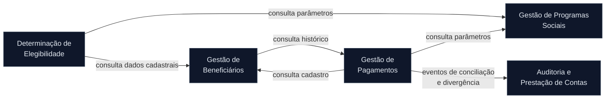

<!-- markdownlint-disable MD012 MD013 MD022 MD025 MD026 MD028 MD029 MD031 MD033 MD034 MD038 MD040 MD051 MD060 -->

# Mapa de Bounded Contexts

Este mapa registra a decisão da equipe para o Modular Monolith do SIFAP. A análise parte das hipóteses do [relatório de descoberta](../01-arqueologia/discovery-report.md), das regras confirmadas no [catálogo de regras de negócio](../01-arqueologia/business-rules-catalog.md) e das 47 arestas documentadas no [mapa de dependências](../01-arqueologia/dependency-map.md).

## Critérios de Avaliação

- **Coesão:** proximidade das regras com uma mesma capacidade de negócio. Alta é favorável.
- **Acoplamento:** quantidade e importância das dependências que cruzam a fronteira. Baixo é favorável.
- **Frequência de mudança:** probabilidade de os programas mudarem juntos, inferida por ownership de dados, nomes e lógica duplicada. Alta co-mudança é favorável; como não há chamadas entre programas, a evidência é indireta.

Cada capacidade final tem um único módulo responsável e uma classificação `Core` ou `Supporting`. Nenhuma fronteira representa um serviço implantável: todos os contextos fazem parte da mesma aplicação e se comunicam in-process.

## Avaliação de Hipóteses

### Hipótese 1: Gestão de Programas Sociais — ACEITA

| Critério | Avaliação | Evidência |
| --- | --- | --- |
| Coesão | Alta | `CADPROG` concentra cadastro e consulta dos parâmetros de programas sociais, incluindo as regras 41-45. |
| Acoplamento | Baixo | `CADPROG` é o único escritor de `PROGRAMA-SOCIAL`; três programas externos apenas consultam esses dados. |
| Frequência de mudança | Baixa evidência | A hipótese contém um único programa, portanto não há co-mudança interna a observar. A independência do escritor sustenta a fronteira. |

**Decisão da equipe:** aceitar. É a fronteira mais limpa do legado e tem ownership de dados inequívoco.

### Hipótese 2: Elegibilidade — ACEITA COM BLOQUEIOS

| Critério | Avaliação | Evidência |
| --- | --- | --- |
| Coesão | Alta | As regras 1-20 de `VALELEG` formam uma única capacidade de decisão sobre elegibilidade. |
| Acoplamento | Baixo | O programa realiza somente duas leituras externas, uma de `BENEFICIARIO` e outra de `PROGRAMA-SOCIAL`, e não persiste dados. |
| Frequência de mudança | Média | As regras variam com políticas de programas e condições cadastrais, mas estão concentradas em um único programa. |

**Decisão da equipe:** aceitar como **Determinação de Elegibilidade**. M-01 e M-02 bloqueiam a especificação dos comportamentos afetados até validação humana; M-12 bloqueia derivar contratos diretamente das VIEWs legadas. Esses bloqueios não invalidam a fronteira estrutural.

### Hipótese 3: Cadastro de Beneficiários e Dependentes — ACEITA

| Critério | Avaliação | Evidência |
| --- | --- | --- |
| Coesão | Alta | `CADBENEF`, `CADDEPEND`, `VALBENEF` e `VALDOCS` tratam cadastro, dependentes e validação cadastral do mesmo agregado. |
| Acoplamento | Alto | Nove acessos de programas externos cruzam a fronteira de `BENEFICIARIO`. |
| Frequência de mudança | Média | Os nomes e as validações de CPF indicam a mesma área de mudança, embora as três implementações tenham divergido historicamente. |

**Decisão da equipe:** aceitar com o nome **Gestão de Beneficiários**. `CADBENEF` e `CADDEPEND` são os únicos escritores do DDM, garantindo um único dono. `VALBENEF` e `VALDOCS` são incorporados conceitualmente, sem preservar suas referências quebradas como contratos modernos.

### Hipótese 4: Processamento de Pagamento — ACEITA COM AJUSTE

| Critério | Avaliação | Evidência |
| --- | --- | --- |
| Coesão | Alta | Geração, cálculo, descontos, correção e conciliação compõem o ciclo de vida de pagamentos. |
| Acoplamento | Alto | O grupo lê dados de beneficiários e programas, recebe CNAB e é consultado por relatórios e histórico cadastral. |
| Frequência de mudança | Alta | Cinco escritores compartilham `PAGAMENTO`; as fórmulas duplicadas em `BATCHPGT` e `CALCBENF` mostram forte necessidade de mudança coordenada. |

**Decisão da equipe:** aceitar como **Gestão de Pagamentos**, retirando o ownership de `AUDITORIA`. O contexto publica eventos internos de conciliação e divergência para Auditoria e Prestação de Contas. M-20 bloqueia escolher uma implementação de cálculo como referência sem validação humana.

### Hipótese 5: Consulta e Prestação de Contas — REJEITADA E REDISTRIBUÍDA

| Critério | Avaliação | Evidência |
| --- | --- | --- |
| Coesão | Baixa | Consulta cadastral, relatórios de pagamento e relatório de auditoria são capacidades distintas, unidas apenas por serem read-only. |
| Acoplamento | Alto | Oito acessos cruzam para `BENEFICIARIO`, `PAGAMENTO` e `AUDITORIA`. |
| Frequência de mudança | Baixa | Os programas não se chamam, consultam dados diferentes e possuem históricos de alteração independentes. |

**Decisão da equipe:** rejeitar a fronteira original. `CONSBENF` passa para Gestão de Beneficiários; `BATCHREL` e `RELPGT`, para Gestão de Pagamentos; e `RELAUDIT`, para Auditoria e Prestação de Contas. A redistribuição elimina um agrupamento técnico baseado apenas em leitura.

## Bounded Contexts Finais

### Gestão de Programas Sociais

- **Classificação:** `Core`.
- **Owner:** módulo Gestão de Programas Sociais.
- **Responsabilidade:** manter a definição dos programas sociais e seus parâmetros de operação, elegibilidade e cálculo. O contexto protege o significado desses parâmetros e impede que outros módulos dependam diretamente do schema de persistência.
- **Dados sob ownership:** `PROGRAMA-SOCIAL` (FNR 151). Programa legado alocado: `CADPROG`.
- **Interface pública:** `cadastrarPrograma(ComandoCadastroPrograma)`, `consultarPrograma(CodigoPrograma)`, `obterParametrosDeElegibilidade(CodigoPrograma)` e `obterParametrosDePagamento(CodigoPrograma)`.
- **Por que é um contexto próprio:** possui capacidade de negócio coesa, um único escritor e baixo acoplamento de entrada.

### Gestão de Beneficiários

- **Classificação:** `Core`.
- **Owner:** módulo Gestão de Beneficiários.
- **Responsabilidade:** manter o cadastro do beneficiário, seus dependentes, situação cadastral e validações de identidade. Também oferece a consulta cadastral, compondo o histórico de pagamentos por meio de uma interface pública de Gestão de Pagamentos, sem acessar sua persistência.
- **Dados sob ownership:** `BENEFICIARIO` (FNR 150). Programas legados alocados: `CADBENEF`, `CADDEPEND`, `VALBENEF`, `VALDOCS` e `CONSBENF`.
- **Interface pública:** `cadastrarBeneficiario(ComandoCadastroBeneficiario)`, `alterarBeneficiario(ComandoAlteracaoBeneficiario)`, `incluirDependente(IdentificadorBeneficiario, DadosDependente)`, `consultarBeneficiario(IdentificadorBeneficiario)` e `obterDadosParaElegibilidade(IdentificadorBeneficiario)`.
- **Por que é um contexto próprio:** concentra os únicos escritores do cadastro e mantém as invariantes do agregado beneficiário sob um único owner.

### Determinação de Elegibilidade

- **Classificação:** `Core`.
- **Owner:** módulo Determinação de Elegibilidade.
- **Responsabilidade:** avaliar um beneficiário para um programa social e produzir uma decisão com todos os motivos de recusa aplicáveis. O contexto consome representações mínimas dos contextos de Beneficiários e Programas Sociais e não acessa suas tabelas.
- **Dados sob ownership:** nenhum DDM legado; possui o modelo de decisão e suas regras. Programa legado alocado: `VALELEG`.
- **Interface pública:** `avaliarElegibilidade(IdentificadorBeneficiario, CodigoPrograma)` retorna `DecisaoElegibilidade` com resultado e motivos.
- **Por que é um contexto próprio:** a decisão de elegibilidade é uma capacidade coesa, sem escrita compartilhada e com ritmo de mudança ditado por políticas de negócio.

### Gestão de Pagamentos

- **Classificação:** `Core`.
- **Owner:** módulo Gestão de Pagamentos.
- **Responsabilidade:** controlar o ciclo de vida do pagamento, da geração ao cálculo, aplicação de descontos, correção, conciliação bancária e consultas de histórico e consolidação. O contexto preserva as invariantes monetárias e é o único autorizado a alterar pagamentos.
- **Dados sob ownership:** `PAGAMENTO` (FNR 152). Programas legados alocados: `BATCHPGT`, `CALCBENF`, `CALCDSCT`, `CALCCORR`, `BATCHCON`, `BATCHREL` e `RELPGT`.
- **Interface pública:** `gerarPagamentos(Competencia)`, `calcularPagamento(IdentificadorBeneficiario, Competencia)`, `aplicarDescontos(IdentificadorPagamento)`, `aplicarCorrecao(IdentificadorBeneficiario, Periodo)`, `conciliarRetorno(RetornoBancario)`, `consultarHistorico(IdentificadorBeneficiario)` e `consolidarPagamentos(FiltroConsolidacao)`.
- **Por que é um contexto próprio:** o alto acoplamento interno ao DDM e a necessidade de consistência monetária exigem um único owner para todo o ciclo de pagamento.

### Auditoria e Prestação de Contas

- **Classificação:** `Supporting`.
- **Owner:** módulo Auditoria e Prestação de Contas.
- **Responsabilidade:** registrar eventos auditáveis produzidos por outros contextos e disponibilizar consultas íntegras da trilha. A primeira integração confirmada cobre conciliações e divergências de pagamento; novos tipos de evento dependem de requisitos rastreáveis antes de serem incorporados.
- **Dados sob ownership:** `AUDITORIA` (FNR 153). Programa legado alocado: `RELAUDIT`; a escrita existente em `BATCHCON` é substituída por eventos internos emitidos por Gestão de Pagamentos.
- **Interface pública:** consumo dos eventos `PagamentoConciliado` e `DivergenciaDePagamento`; `consultarEventos(FiltroAuditoria)` para leitura da trilha.
- **Por que é um contexto próprio:** possui obrigação de integridade distinta do processamento financeiro e precisa controlar exclusivamente a gravação e apresentação da trilha.

## Comunicação Inter-Context

| De | Para | Direção e mecanismo | Dados trocados |
| --- | --- | --- | --- |
| Determinação de Elegibilidade | Gestão de Beneficiários | Chamada in-process via interface de consulta | `IdentificadorBeneficiario` e DTO mínimo com situação e atributos necessários à avaliação |
| Determinação de Elegibilidade | Gestão de Programas Sociais | Chamada in-process via interface de consulta | `CodigoPrograma` e DTO de parâmetros de elegibilidade |
| Gestão de Pagamentos | Gestão de Beneficiários | Chamada in-process via interface de consulta | ID, situação cadastral e dados estritamente necessários ao cálculo |
| Gestão de Pagamentos | Gestão de Programas Sociais | Chamada in-process via interface de consulta | código e parâmetros de pagamento |
| Gestão de Beneficiários | Gestão de Pagamentos | Chamada in-process para compor consulta cadastral | ID e resumo do histórico de pagamentos |
| Gestão de Pagamentos | Auditoria e Prestação de Contas | Domain events in-process | `PagamentoConciliado` e `DivergenciaDePagamento`, contendo IDs, competência, resultado e valores necessários à trilha |

O shared kernel fica restrito a identificadores e value objects estáveis, como `IdentificadorBeneficiario`, `CodigoPrograma`, `IdentificadorPagamento`, `Competencia` e `ValorMonetario`. Entidades, repositories e DTOs de persistência não atravessam fronteiras.

## Diagrama Mermaid do Mapa de Contexto

## Restrições e Bloqueios

- M-01 e M-02 impedem transformar os comportamentos ambíguos de elegibilidade em requisitos até validação humana.
- M-12 impede derivar o schema PostgreSQL ou os contratos modernos das VIEWs dos programas.
- M-20 impede selecionar a implementação de cálculo de benefício e desconto que será modernizada.
- M-47 impede especificar a política de exibição de exclusões na auditoria sem decisão humana e evidência registrada.
- Toda comunicação definida aqui é in-process dentro de um Modular Monolith; não há HTTP nem mensageria entre os contextos.

## Aprovação

- **Data:** 2026-08-12
- **Decisão:** equipe aceitou todas as recomendações da avaliação, incluindo os ajustes das hipóteses 4 e 5.
- **Próximo gate:** usar estes contextos como entrada para `/speckit.clarify` e para o recorte fino da feature; nenhum bloqueio acima pode ser convertido em EARS sem validação humana.
